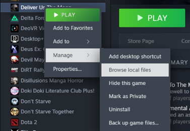
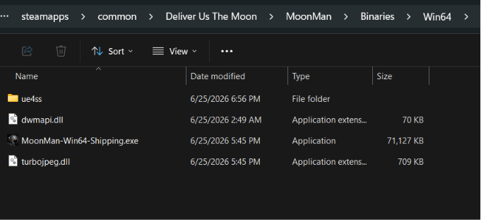

# Deliver Us The Moon - Experimental Flat First Person Mod

This is an **experimental UE4SS Lua mod** that forces Deliver Us The Moon into its native first-person mode.

It is based on the UEVR profile's key discovery: the player pawn has a native `bFirstPerson` boolean. The script repeatedly sets that flag during normal gameplay and hides the third-person body mesh to avoid clipping. It leaves cutscenes and climbing in third-person. This allows you to play the game in first person without VR as we use UE4SS

## Install

1. Download the latest version of UE4SS (as of writing, latest confirmed working is v3.0.1) https://github.com/UE4SS-RE/RE-UE4SS/release
2. Navigate to the local files of the game, in steam right click -> manage -> Browse local files



3. Navigate to MoonMan -> Binaries -> Win64 and extract UE4SS. Your directory should look like this 



4. Navigate to ue4ss -> Mods and copy the `MoonManFlatFirstPerson` folder into your UE4SS `Mods` folder.
5. Edit `Mods/mods.txt` and add:

```txt
MoonManFlatFirstPerson : 1
```

6. Save the mods.txt file
4. Launch the game.

## Controls

- `F8` toggles the patch on/off.
- UE console commands, if your UE4SS console is available:
  - `dutm_fp_on`
  - `dutm_fp_off`
  - `dutm_fp_toggle`

## Caveats

- I haven't fully tested the mod
- The script may need property-name fixes if this game hides or strips some reflected Blueprint fields.
- It intentionally avoids forcing first-person during cutscenes, climbing, ASE robot control, and frozen/cinematic pawn states.
